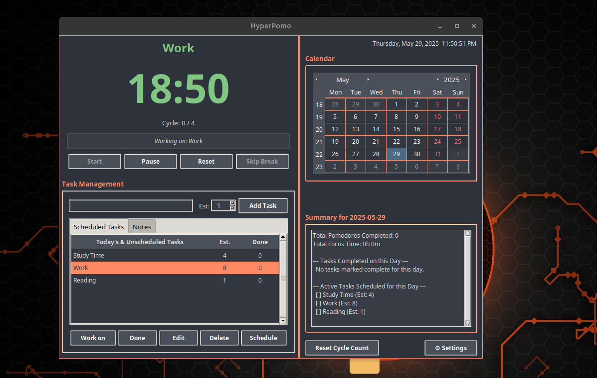
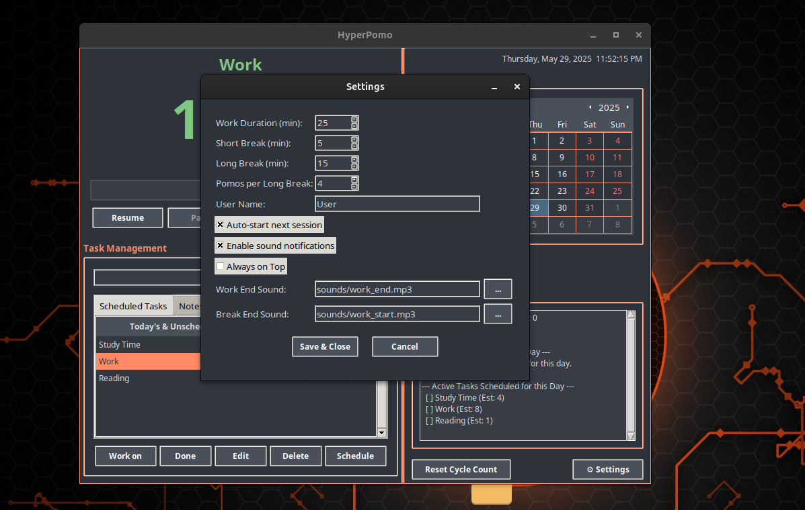

# HyperPomo - Pomodoro Timer & Task Planner

HyperPomo is a feature-rich Pomodoro timer and task planner designed to help users, especially those with ADHD, manage their time and tasks effectively. It was built because other tools didn't offer the desired level of customization and all-in-one functionality.

## Features

*   Customizable Pomodoro, Short Break, and Long Break timers
*   Integrated To-Do List with estimated/actual Pomodoros per task
*   Task scheduling with a built-in calendar view
*   Daily summary of Pomodoros and focus time
*   Notes feature for each task
*   Audio notifications with customizable sounds
*   "Always on Top" mode for the application window
*   Session logging to track your work patterns
*   Modern, clean interface with keyboard shortcuts for quick actions





## Downloads (Recommended for Most Users)

Pre-compiled, ready-to-run versions of HyperPomo for Linux, Windows, and macOS (if available) can be found on the **[GitHub Releases Page](https://github.com/Neverlow512/HyperPomo/releases)**. This is the easiest way to get started.


---

## Running or Building from Source Code

If you prefer to run from the source code or build the application yourself, follow these instructions.

### Prerequisites (All Platforms)

*   **Python 3:** Version 3.8 or higher is recommended. Download from [python.org](https://www.python.org/) if you don't have it. Ensure Python and Pip are added to your system's PATH during installation (especially on Windows).
*   **Git:** For cloning the repository. Download from [git-scm.com](https://git-scm.com/).

### Platform-Specific Prerequisites

*   **Linux (Ubuntu/Debian-based):**
    *   **Tkinter:**
        ```bash
        sudo apt update
        sudo apt install python3-tk
        ```
    *   **Sound Support (GStreamer & PyGObject for `playsound`):**
        ```bash
        sudo apt install libgstreamer1.0-0 gstreamer1.0-plugins-base gstreamer1.0-plugins-good gstreamer1.0-plugins-ugly python3-gi
        ```
*   **Windows & macOS:**
    *   Tkinter is typically included with standard Python installations from python.org.
    *   Sound playback usually works out-of-the-box with `playsound`.

### Setup Instructions (All Platforms)

1.  **Clone the Repository:**
    Open your terminal (Command Prompt or PowerShell on Windows, Terminal on macOS/Linux) and run:
    ```bash
    git clone https://github.com/Neverlow512/HyperPomo.git
    cd HyperPomo
    ```
    

2.  **Set up Python Environment & Install Dependencies:**

    *   **Method A: Using a Virtual Environment (Strongly Recommended)**
        This method isolates project dependencies and is the best practice for Python development.
        ```bash
        # Navigate to the HyperPomo project directory if you're not already there
        # cd HyperPomo 
        python3 -m venv .venv 
        # On Windows: .venv\Scripts\activate
        # On macOS/Linux: source .venv/bin/activate
        source .venv/bin/activate 
        pip install -r requirements.txt 
        # To run the app later: python run_pomodoro.py (or python3)
        # When done using the app and you want to leave the virtual environment: deactivate
        ```

    *   **Method B: Global-User Installation (Linux - If you avoid venv)**
        This installs packages to your user's local Python package directory. On newer Linux distributions (like Ubuntu 22.04+ with Python 3.11+), this might require overriding system protections (PEP 668).
        ```bash
        # Navigate to the HyperPomo project directory
        # cd HyperPomo 

        # Ensure pip is up-to-date
        pip3 install --upgrade pip

        # Install dependencies (may require --break-system-packages on some systems)
        # Try without the flag first:
        # pip3 install --user -r requirements.txt
        # If you encounter an "externally-managed environment" error:
        pip3 install -r requirements.txt --break-system-packages
        ```
        *(Note on `--break-system-packages`*: This flag bypasses your OS's protection. While the risk for the listed dependencies is generally low, use it with awareness.)*

    *   **Method C: Global Installation (Windows / macOS):**
        Open your terminal or command prompt, navigate to the `HyperPomo` directory.
        ```bash
        pip install -r requirements.txt
        ```

3.  **(Linux Only - If using global pip installs) Ensure `~/.local/bin` is in your PATH:**
    If `pip` installs scripts (like `pyinstaller`) to `~/.local/bin`, this directory should be in your `PATH`. This step is mostly for accessing the `pyinstaller` command directly if installed globally/user-wide. If you installed PyInstaller in a virtual environment, this is handled automatically when the environment is active.
    If you received a PATH warning during `pip` installation of PyInstaller, add the following line to your `~/.bashrc` (for Bash) or `~/.zshrc` (for Zsh):
    ```bash
    export PATH="$HOME/.local/bin:$PATH"
    ```
    Then, apply the changes: `source ~/.bashrc` (or `source ~/.zshrc`) or open a new terminal.

### Running HyperPomo from Source

Once prerequisites and dependencies are installed:

1.  Navigate to the `HyperPomo` project directory.
2.  If using a virtual environment, ensure it's activated.
3.  Run the application:
    ```bash
    # On macOS/Linux:
    python3 run_pomodoro.py
    # On Windows (if python3 isn't aliased, 'python' might work if it's in PATH):
    # python run_pomodoro.py 
    ```

---

## Building an Executable Bundle (Optional)

You can create a standalone executable bundle using PyInstaller.

### 1. Install PyInstaller

Ensure PyInstaller is installed (it's listed in `requirements.txt`). If you set up your environment as described above, it should be available. If not:
*   **Inside an activated virtual environment (recommended):**
    ```bash
    pip install pyinstaller
    ```
*   **Globally (with caution on PEP 668 Linux systems):**
    ```bash
    # Linux:
    pip3 install pyinstaller --break-system-packages
    # Windows/macOS:
    pip install pyinstaller
    ```

### 2. Prepare Icons

Ensure the following icons are present in the `HyperPomo/Misc/` directory:
*   `HyperPomo.png`: A high-resolution PNG (e.g., 256x256 or 512x512) with a transparent background. This is primarily for the Linux desktop entry and can be used as a runtime window icon.
*   `HyperPomo.ico`: A multi-resolution ICO file. This is crucial for the Windows executable's embedded icon and can also serve as a runtime window icon.
*   **(macOS Optional but Recommended)** `HyperPomo.icns`: An Apple ICNS file. This is the standard for macOS application bundle icons.

### 3. Build the Application (General Command)

From the `HyperPomo` project root directory, run:
```bash
pyinstaller HyperPomo.spec
```

This uses the provided `HyperPomo.spec` file for build configuration. The output will be in the `dist/` folder.

### 4. Platform-Specific Build Notes & Distribution

#### Linux

*   **Output:** The command above will create a folder `dist/HyperPomo/` containing the executable (`HyperPomo`) and all necessary files.
*   **Desktop Integration:** To integrate HyperPomo with your desktop menu and have a proper application icon:
    ```bash
    chmod +x install.sh
    ./install.sh
    ```
    This script copies the application from `dist/HyperPomo` to `~/.local/share/HyperPomoApp` (by default) and creates a `.desktop` menu entry using `Misc/HyperPomo.png` as the icon. You might need to log out and back in for the menu item to appear correctly.
*   **To Uninstall (if you used `install.sh`):**
    ```bash
    chmod +x uninstall.sh
    ./uninstall.sh
    ```
*   **Distribution (for GitHub Releases):** Create a `.tar.gz` or `.zip` archive of the `dist/HyperPomo` folder (e.g., `HyperPomo-vX.Y.Z-linux-x64.tar.gz`). Users would extract this and then can optionally run `install.sh`.

#### Windows

*   **Icon:** Ensure `Misc/HyperPomo.ico` is present before building. The `HyperPomo.spec` file is configured to use this for the `.exe` icon.
*   **Output:** The command `pyinstaller HyperPomo.spec` will create a folder `dist/HyperPomo/` containing `HyperPomo.exe` and all its supporting files (unless you modify the spec for `--onefile`).
*   **Running:** Users can run `HyperPomo.exe` directly from the `dist/HyperPomo/` folder.
*   **Distribution (for GitHub Releases):** Create a `.zip` archive of the entire `dist/HyperPomo` folder (e.g., `HyperPomo-vX.Y.Z-windows-x64.zip`).
    *   For a more traditional Windows installation experience (with a `setup.exe`, shortcuts, etc.), you would use a third-party installer creator tool (like Inno Setup or NSIS) on the PyInstaller output. This is an additional step not covered here.

#### macOS

*   **Icon:** For the best results, create an `.icns` file (e.g., `HyperPomo.icns`) from your high-resolution PNG and place it in `HyperPomo/Misc/`.
    *   **Modify `HyperPomo.spec`:**
        *   In the `EXE` block, change `icon='Misc/HyperPomo.ico'` to `icon='Misc/HyperPomo.icns'`.
        *   In the `datas` list within the `Analysis` block, ensure the `.icns` file is included: `('Misc/HyperPomo.icns', 'Misc')`.
*   **Output:** After modifying the `.spec` file and running `pyinstaller HyperPomo.spec`, PyInstaller will typically create a `HyperPomo.app` bundle in the `dist/` folder. This `.app` bundle is a folder that appears as a single clickable application.
*   **Running & "Installation":** Users usually drag the `HyperPomo.app` bundle from the `dist/` folder into their main `/Applications` folder.
*   **Distribution (for GitHub Releases):**
    *   The standard way to distribute macOS applications is as a `.dmg` (disk image) file containing your `HyperPomo.app` bundle. Creating a `.dmg` involves using macOS tools like Disk Utility or command-line utilities after building the `.app` bundle.
    *   Alternatively, you can provide a `.zip` file of the `HyperPomo.app` bundle.

## Troubleshooting

*   **Sound Issues on Linux:** Ensure GStreamer plugins and `python3-gi` are installed via `apt` as per the Prerequisites. Check the terminal output from `run_pomodoro.py` for any errors when sounds are supposed to play.
*   **Icon Not Appearing Correctly (Linux Desktop Entry):** After running `install.sh`, if the icon is wrong or missing in your application menu, try logging out and back in. Confirm the `HyperPomo.png` in `Misc/` has a transparent background *before* building with PyInstaller.
*   **`ModuleNotFoundError` after PyInstaller build:** Some dependencies might rarely be missed by PyInstaller. If so, they may need to be added to the `hiddenimports` list in the `HyperPomo.spec` file, then rebuild the application.
*   **Permissions issues on Linux after `install.sh`:** Ensure `install.sh` and `HyperPomo` (in the installation directory) are executable (`chmod +x`).

